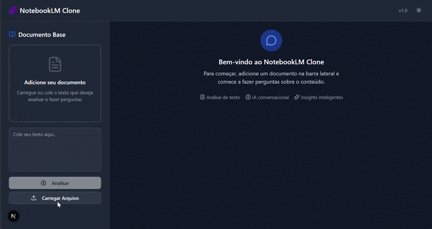

# NotebookLM Clone

Um clone moderno e funcional do Google NotebookLM, construído com Next.js, que permite analisar documentos e fazer perguntas utilizando inteligência artificial.

## 🎥 Demonstração

### 📸 Veja a aplicação em ação


## ✨ Funcionalidades

- 📄 **Upload de Documentos**: Suporte para arquivos `.txt`, `.md`, `.pdf`, `.doc` e `.docx`
- 🖱️ **Drag & Drop**: Interface intuitiva para arrastar e soltar arquivos
- 🤖 **Chat com IA**: Faça perguntas sobre o conteúdo do documento usando Google Gemini
- 📋 **Preview de Conteúdo**: Visualize e edite o conteúdo antes de analisar
- 🎨 **Tema Escuro/Claro**: Alternância simples entre temas
- 📱 **Interface Responsiva**: Design moderno que funciona em qualquer dispositivo
- 💬 **Sugestões Inteligentes**: Perguntas pré-definidas para começar rapidamente
- 🔄 **Chat em Tempo Real**: Conversação fluida com histórico de mensagens
- 🎯 **Notificações**: Feedback visual para todas as ações do usuário

## 🚀 Como Usar

### 1. Faça upload de um documento
- Clique em "Carregar Arquivo" ou arraste um arquivo para a área indicada
- Cole texto diretamente na caixa de texto
- Visualize o conteúdo carregado

### 2. Analise o documento
- Clique em "Analisar Documento" para processar o conteúdo
- Aguarde a confirmação de que o documento foi carregado

### 3. Faça perguntas
- Digite suas perguntas no campo de chat
- Use as sugestões prontas para começar rapidamente
- Receba respostas detalhadas baseadas no conteúdo do documento

## ⚙️ Configuração e Instalação

### Pré-requisitos
- Node.js 18+ 
- npm, yarn, pnpm ou bun

### 1. Clone o repositório
```bash
git clone https://github.com/vieiraeduardos/notebooklm-clone-app.git
cd notebooklm-clone-app
```

### 2. Instale as dependências
```bash
npm install
# ou
yarn install
# ou
pnpm install
```

### 3. Configure as variáveis de ambiente
```bash
cp .env.example .env
```

### 4. Obtenha sua chave do Google Gemini

#### Como obter a chave da API do Google Gemini:

1. **Acesse o Google AI Studio**
   - Vá para [https://aistudio.google.com/](https://aistudio.google.com/)
   - Faça login com sua conta Google

2. **Crie uma nova chave de API**
   - Clique em "Get API key" ou "Obter chave de API"
   - Clique em "Create API key in new project" ou "Criar chave de API em novo projeto"
   - Ou selecione um projeto existente

3. **Copie sua chave**
   - A chave será gerada automaticamente
   - Copie a chave e guarde em local seguro
   - **⚠️ Importante**: Não compartilhe sua chave publicamente

4. **Configure no arquivo .env**
   ```bash
   GOOGLE_AI_API_KEY=sua_chave_aqui
   ```

### 5. Execute o projeto
```bash
npm run dev
# ou
yarn dev
# ou
pnpm dev
```

### 6. Acesse a aplicação
Abra [http://localhost:3000](http://localhost:3000) no seu navegador.

## 🛠️ Tecnologias Utilizadas

- **Frontend**: Next.js 15, React 19, TypeScript
- **UI**: Tailwind CSS, Shadcn/ui
- **IA**: Google Gemini AI (via @google/genai)
- **Ícones**: Lucide React
- **Desenvolvimento**: ESLint, PostCSS

## 📁 Estrutura do Projeto

```
├── app/
│   ├── api/
│   │   ├── ask/           # Endpoint para perguntas
│   │   └── upload-text/   # Endpoint para upload de texto
│   ├── globals.css
│   ├── layout.tsx
│   └── page.tsx
├── components/
│   ├── ui/               # Componentes Shadcn/ui
│   ├── chat-interface.tsx # Componente principal do chat
│   └── theme-provider.tsx # Provedor de tema
├── lib/
│   ├── utils.ts          # Utilitários
│   └── base-text-store.ts # Store global para texto base
├── services/
│   └── gemini-service.ts  # Serviço do Google Gemini
└── docs/
    └── video.mp4         # Vídeo demonstrativo
    └── sample.png         # Screenshot demonstrativo
```

## 🔧 Scripts Disponíveis

```bash
npm run dev       # Executa em modo desenvolvimento
npm run build     # Cria build de produção
npm run start     # Executa build de produção
npm run lint      # Verifica problemas de código
```

## 🆘 Problemas Comuns

### Erro de API Key
```
Error: API key not found
```
**Solução**: Verifique se a variável `GOOGLE_AI_API_KEY` está configurada no arquivo `.env`

### Erro de CORS
```
CORS policy error
```
**Solução**: Certifique-se de estar executando em `localhost:3000`

### Erro de Upload
```
File upload failed
```
**Solução**: Verifique se o arquivo está em um formato suportado (.txt, .md, .pdf, .doc, .docx)

## 🙋‍♂️ Suporte

Se você encontrar problemas ou tiver dúvidas:
1. Verifique os [problemas existentes](https://github.com/vieiraeduardos/notebooklm-clone-app/issues)
2. Crie um novo [issue](https://github.com/vieiraeduardos/notebooklm-clone-app/issues/new)
3. Descreva o problema com detalhes e passos para reproduzir

---

⭐ **Gostou do projeto?** Deixe uma estrela no repositório!
